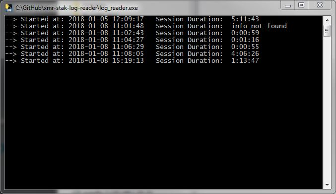

## What is it?
- Simple utility to read xmr-stak log files
- Designed to group logged data into "Sessions". 
- One session is single xmr-stak.exe run

## Status?
- Alpha AF
- Prints date of each session start and its duration.

## Usage:
1. download log_reader.exe
2. run
3. when asked for file, point to xmr-stak log file.

## How it looks like?
Below is the result of feeding it with log.txt (example log file available in this repo)

